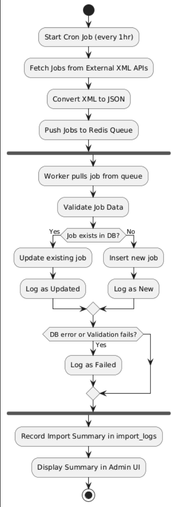

# 🛠️ Job Importer

A full-stack application that imports job listings from external feeds, stores them in MongoDB, and processes background tasks using Redis and Bull. The frontend is a simple admin dashboard built with Next.js.

---

## ✅ Requirements

- **Node.js** ≥ 18.x
- **MongoDB** (Local or [MongoDB Atlas](https://www.mongodb.com/atlas))
- **Redis** (Local or cloud-based, e.g. [Upstash](https://upstash.com/) or [Redis Cloud](https://redis.com/))

---

## 📦 Installation

Clone the repository:

```bash
git clone https://github.com/your-username/job-importer.git
cd job-importer


cd backend
npm install

PORT=3001
MONGO_URI=mongodb://localhost:27017/job_importer
REDIS_URL=redis://localhost:6379
FEEDS=https://jobicy.com/?feed=job_feed,https://jobicy.com/?feed=job_feed&job_categories=smm&job_types=full-time


cd ../frontend
npm install

NEXT_PUBLIC_API_URL=http://localhost:3001


cd backend
npm start

cd frontend
npm run dev


```

## 🧱 System Architecture

Below is the architecture diagram of the entire system:


